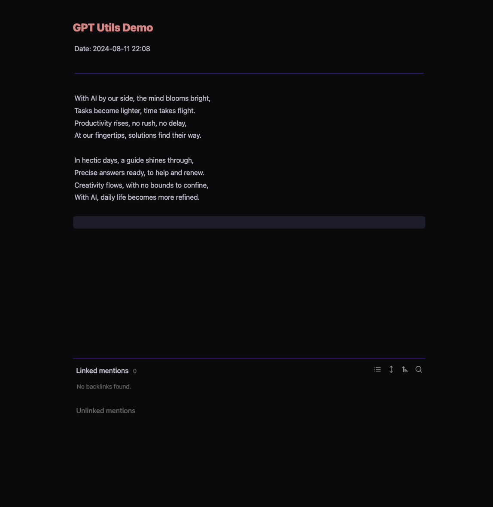
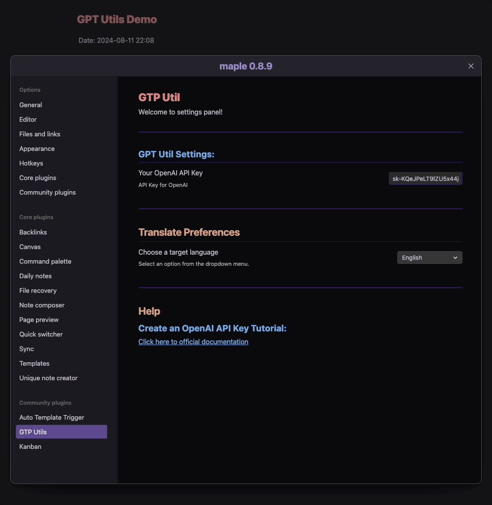
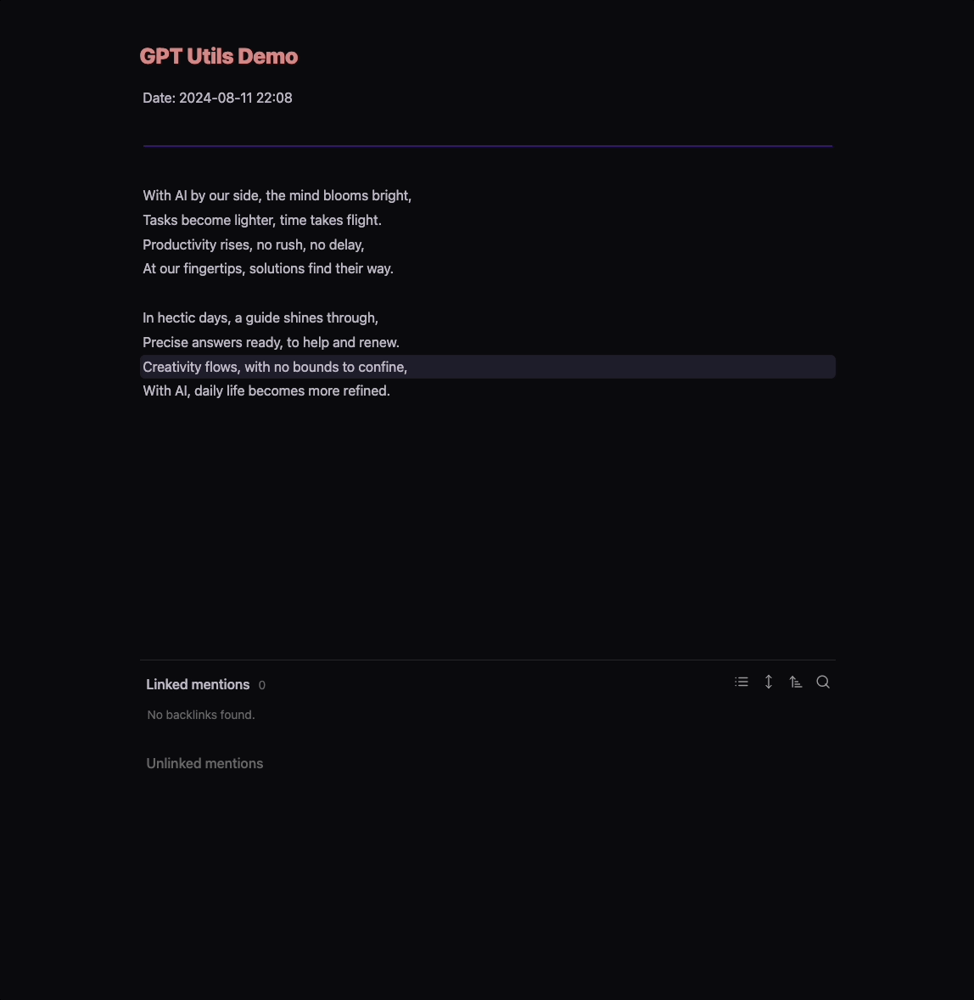

## GPT Utils: Your Daily AI-Powered Assistant for Obsidian

Welcome to **GPT Utils**—your new go-to plugin for supercharging your Obsidian experience with the power of generative AI. Designed to streamline your workflow, GPT Utils is here to tackle those small, yet time-consuming, tasks that can disrupt your creative flow.

### Why GPT Utils?

In the fast-paced world we live in, efficiency is everything. Whether you’re managing a vast knowledge base, taking notes, or organizing your thoughts, every second counts. That’s where GPT Utils comes in. By leveraging the advanced capabilities of AI, this plugin not only saves you time but also enhances the quality of your work.

### Current Feature: Seamless Translation

Currently, GPT Utils offers a robust translation feature. Need to translate your notes or content into another language? With just a few clicks, GPT Utils delivers high-quality translations that maintain the nuance and meaning of the original text.

### What’s Next?

But that’s just the beginning. We’re actively working on adding more features to make your Obsidian experience smoother and more productive. Whether it’s content generation, summarization, or any other task you can think of, GPT Utils will soon become an indispensable tool in your daily routine.

### Join the Community

Be among the first to harness the power of GPT Utils and transform the way you use Obsidian. Stay tuned for updates and new features that will make your workflow even more efficient.

Embrace the future of productivity—start using GPT Utils today!

---

### Demonstration of Functionality

Here are some examples of how **GPT Utils** works within Obsidian:

_Using it is very simple:_

1. Open the file you want to translate.
2. Select the text you want to translate.
3. Access the main menu through the shortcut **Ctrl + P** and search for "GPT

**Utils: Translate content**"

_To change the target language, do the following:_

1. Go to Obsidian settings.
2. Go to Community plugins.
3. Search for the "GPT Utils" plugin and click on the gear icon.
4. Go to "**Translate Preferences**" and change the language.

_See the example of translation to Brazilian Portuguese:_

---

## About the Author

    

Hello! I’m **Wellington Rogati**, the developer behind **GPT Utils**. I am committed to creating tools that make your daily life easier, allowing you to focus on what really matters. This plugin is offered for free to the Obsidian community, but like any project, it involves time and dedication.

**Here’s where you can find me:**
GitHub: https://github.com/wrogati
LinkedIn: https://www.linkedin.com/in/wellington-rogati/

### Contribute to the Development

If you’ve found value in GPT Utils and wish to support my work, please consider making a contribution. This will help cover the time invested and encourage the continued development of new features.

**Make a donation via PayPal:**

Via QR Code

or use the link: https://www.paypal.com/donate/?hosted_button_id=CGX73TDQ6LKKA

Your contribution, no matter how small, is greatly appreciated and will allow me to continue improving GPT Utils for the community. Thank you very much for your support!

